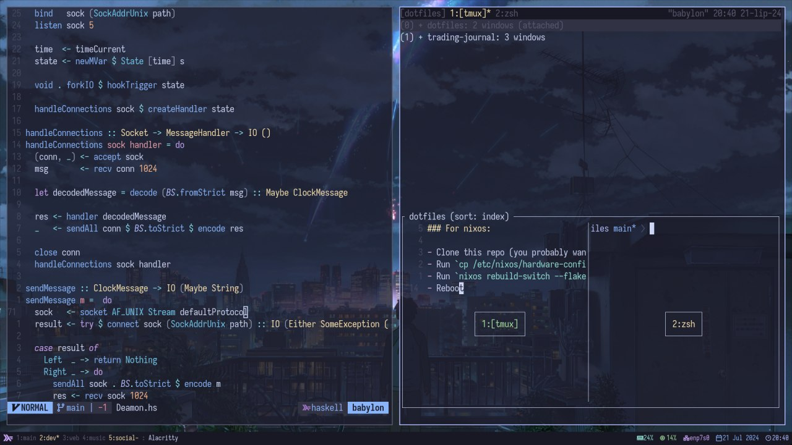

# Dotfiles

My dotfiles powered by <a href="https://github.com/snowfallorg">snowfall</a>, containing my whole system configuration, home configuration and neovim setup.

## Usage

### System:

- Clone this repo (you probably want to use `nix-shell -p git` on a fresh system) and `cd` into it,
- Run `cp /etc/nixos/hardware-configuration.nix systems/x86_64-linux/babylon`,
- Run `nixos rebuild-switch --flake .#default`,

### Neovim:

Add this to your `flake.nix`:

```nix
# your flake.nix

inputs = {
    ...
    neovim.url = "github:geraldserafin/dotfiles";
    neovim.inputs.nixpkgs.follows = "nixpkgs";
}
```

Alternatively you can simply run `nix run github:geraldserafin/dotfiles#neovim`
